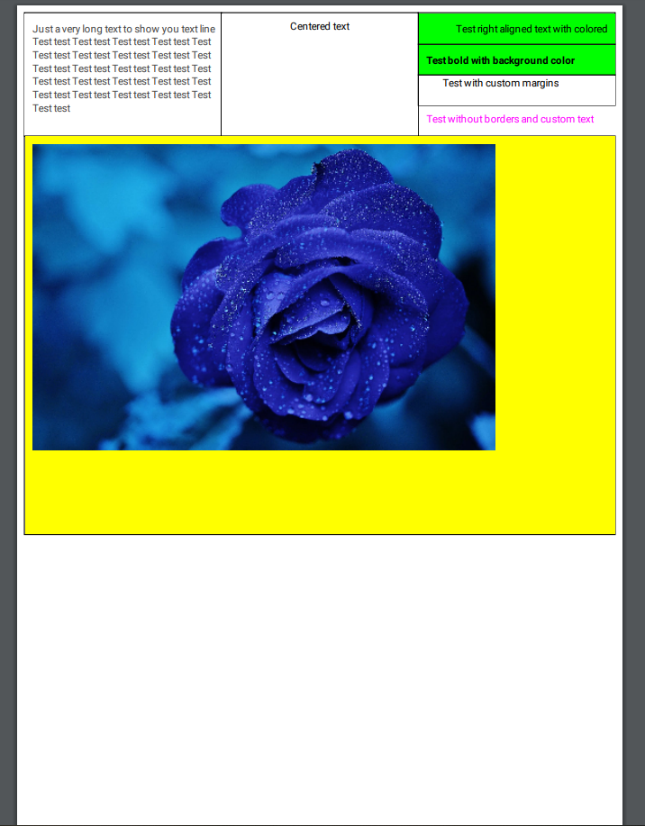

# Android PDF Table
This lib was created for helping people with table generating in PDF files. 

### Usage

You can easily customize whole Table, Row, Column, Cell, just put `Preferences` class in an appropriate element.

```
 val outputStream = File(getExternalFilesDir(null)?.absolutePath + "test.pdf").outputStream()
        val rows = mutableListOf<Row>()
        val columns = mutableListOf<Column>()
        columns.add(Column(cells = listOf(Cell(data = "Just a very long text to show you text line breaking: Test test Test test Test test Test test Test test Test test Test test Test test Test test Test test Test test Test test Test test Test test Test test Test test Test test Test test Test test Test test Test test Test test Test test Test test Test test Test test"))))
        columns.add(
            Column(
                cells = listOf(
                    Cell(
                        data = "Centered text",
                        preferences = Preferences(alignType = AlignTypes.CENTER)
                    )
                )
            )
        )
        columns.add(
            Column(
                cells = listOf(
                    Cell(
                        data = "Test right aligned text with colored background",
                        preferences = Preferences(
                            alignType = AlignTypes.RIGHT,
                            backgroundColor = Color.GREEN
                        )
                    ), Cell(
                        data = "Test bold with background color",
                        preferences = Preferences(
                            backgroundColor = Color.GREEN,
                            typeface = Typeface.DEFAULT_BOLD
                        )
                    ),
                    Cell(
                        data = "Test with custom margins",
                        preferences = Preferences(
                            textMargin = Margins(24f, 0f, 2f, 4f)
                        )
                    ),
                    Cell(
                        data = "Test without borders and custom text color",
                        preferences = Preferences(
                            drawBorders = false,
                            textColor = Color.MAGENTA
                        )
                    )
                )
            )
        )

        rows.add(Row(columns = columns, preferences = Preferences(Color.DKGRAY)))

        // Adding image
        rows.add(
            Row(
                columns = listOf(
                    Column(
                        cells = listOf(
                            Cell(
                                data = getFileFromAssets(
                                    baseContext,
                                    "test.jpeg"
                                ).absolutePath,
                                dataType = DataTypes.IMAGE
                            )
                        )
                    )
                )
            )
        )

        Table(
            file = outputStream,
            rows = rows,
            preferences = Preferences(backgroundColor = Color.YELLOW)
        ).drawTable()
```

Result below: 



Also there is feature for moving table to the next page if it doesn't fit in one.
### Important notes

- Requires API 19+

- Feel free for making pull requests, creating issues.

### Installation
Add this to your project level `build.gradle`:
```
allprojects {
    repositories {
        maven { url "https://jitpack.io" }
    }
}
```
 Add this to your app's `build.gradle`:
```
 implementation 'com.github.leshchenko:AndroidPDF-Table:1.0.2'
```
### Did it help you?
<link href="https://fonts.googleapis.com/css?family=Lato&subset=latin,latin-ext" rel="stylesheet"><a class="bmc-button" target="_blank" href="https://www.buymeacoffee.com/4JyfS7Bw2"><span style="margin-left:5px">Buy me a coffee</span></a>

### LICENSE
```
Copyright 2019 Ruslan Leshchenko (leshchenko)

Licensed under the Apache License, Version 2.0 (the "License");
you may not use this file except in compliance with the License.
You may obtain a copy of the License at

http://www.apache.org/licenses/LICENSE-2.0

Unless required by applicable law or agreed to in writing, software
distributed under the License is distributed on an "AS IS" BASIS,
WITHOUT WARRANTIES OR CONDITIONS OF ANY KIND, either express or implied.
See the License for the specific language governing permissions and
limitations under the License.
```